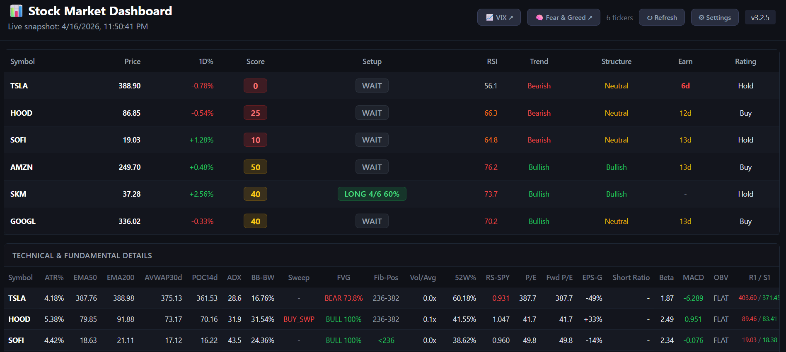
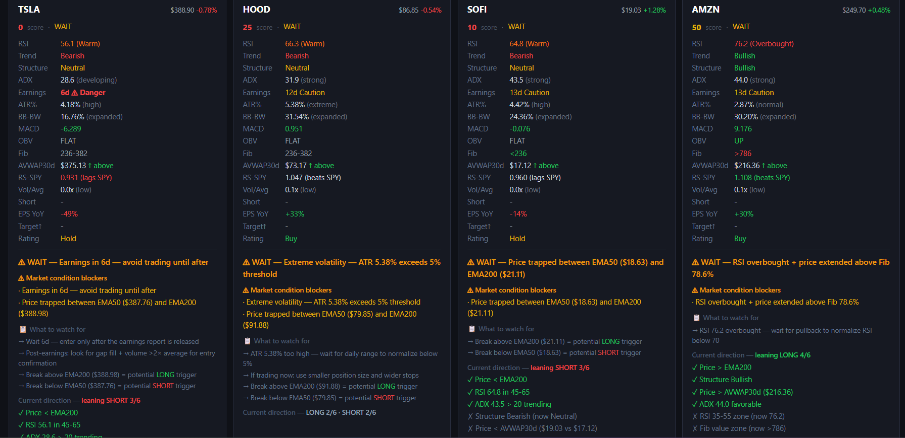

# 📊 Stock Market Dashboard

> **v3.2.5** | Client-side stock analysis. 100% browser. Zero backend.

Real-time technical & fundamental analysis dashboard. Built for traders who want instant insights without the noise.


---

## 🎯 Dashboard Overview

Live data from Financial Modeling Prep Stable API. All calculations happen in your browser — no backend, no server costs.

**Main Dashboard View:**


**Detailed Ticker Analysis:**


---

## ⚡ Quick Start

### Deploy to Cloudflare Pages (2 min)
1. Fork this repo
2. Connect to [Cloudflare Pages](https://pages.cloudflare.com/)
3. Set build output to `/` — done, no build step needed
4. Add your FMP API key → live

### Run Locally
```bash
# Python
python -m http.server 8080

# Or Node.js
npx serve .
```
Open `http://localhost:8080` → enter API key → analyze

### GitHub Pages
Fork → Settings → Pages → Source: main/root folder → live

---

## 📖 How to Use

### 1️⃣ Add Your API Key
- Click **Settings** (top right)
- Enter your [FMP API key](https://site.financialmodelingprep.com/)
- Free tier works — just verify stable endpoints support

### 2️⃣ Watch Your Tickers
- Default: TSLA, HOOD, SOFI, AMZN, SKM, GOOGL
- Edit watchlist in Settings
- Click **Refresh** for live data

### 3️⃣ Read the Signals
Each ticker shows:
- **Score (0–100)**: Composite signal strength
- **Setup**: LONG / SHORT / WAIT with entry signals
- **RSI, Trend, Structure**: Quick momentum reads
- **Earnings**: Days until earnings (avoid trading through)
- **Rating**: Buy/Hold/Sell based on consensus

### 4️⃣ Expand Charts
- Click ticker row → full candlestick chart
- See EMA 50/200, AVWAP, Fibonacci levels
- Hover for full technical breakdown
- Export as PNG

---

## ✨ What It Calculates

**In-Browser (Real-Time):**
- RSI, ATR, EMA 50/200, AVWAP (multiple anchors)
- Point of Control (POC), ADX, Bollinger Bandwidth
- Fibonacci retracements, Market structure, Sweeps, FVGs
- Relative strength vs SPY

**From FMP Stable API:**
- Price data (2 years OHLCV)
- P/E, Beta, Earnings dates
- EPS growth, Short float, Analyst ratings

**Scoring System:**
- **Technical** (50 pts): Structure, RSI, EMAs, AVWAP, Fib levels
- **Fundamental** (30 pts): Earnings safety, EPS growth, P/E
- **Sentiment** (10 pts): Strength vs SPY
- **Penalties**: Earnings risk (−20), Extreme volatility (−15)

---

## 🔑 Setup

### Get Your FMP API Key
1. Sign up: [financialmodelingprep.com](https://site.financialmodelingprep.com/)
2. Get free API key (no credit card needed)
3. Verify it supports **stable endpoints** (`/stable/`)
4. Enter in dashboard Settings

**Privacy**: Key stored in your browser localStorage only. Never sent anywhere except FMP API.

### Change Default Tickers
Edit `js/config.js`:
```javascript
const DEFAULT_TICKERS = ['AAPL', 'MSFT', 'NVDA'];  // your tickers
```

---

## 🏗️ Architecture

```
├── index.html           Main dashboard (single page)
├── js/
│   ├── api.js          FMP Stable API calls
│   ├── technicals.js   20+ indicators
│   ├── scoring.js      Composite score + signals
│   ├── charts.js       Lightweight Charts render
│   └── ui.js           DOM + tooltips
└── README.md
```

**Zero dependencies.** Tailwind & Lightweight Charts loaded from CDN.

---

## 📊 API Usage

~44 requests per refresh (6 tickers + SPY benchmark):
- Historical OHLCV data
- Fundamentals (P/E, earnings, EPS)
- Analyst consensus, short float

All non-critical requests fail gracefully — dashboard loads with available data.

---

## 🚀 Deploy

| Platform | Setup | Output Dir |
|---|---|---|
| **Cloudflare Pages** | Fork + connect | `/` |
| **GitHub Pages** | Settings → Pages | main / root |
| **Any static host** | Upload files | N/A |

---

## 📋 What's New (v3.2.5)

- ✅ Migrated to FMP Stable API (`/stable/` endpoints)
- ✅ API key validation before loading
- ✅ 15-second timeout per request
- ✅ Graceful error handling + retry buttons
- ✅ Rate limit detection (HTTP 429)
- ✅ ARCHITECTURE.md documentation

---

## ⚠️ Disclaimer

**Educational & research purposes only.** Not financial advice. Trading carries risk. Consult a qualified advisor before investing.

---

## 📄 License

MIT License. Use, modify, share freely.

---

## 🤝 Questions?

Check `ARCHITECTURE.md` for technical deep dive. Or file an issue on GitHub.

**Happy trading.** 📈
